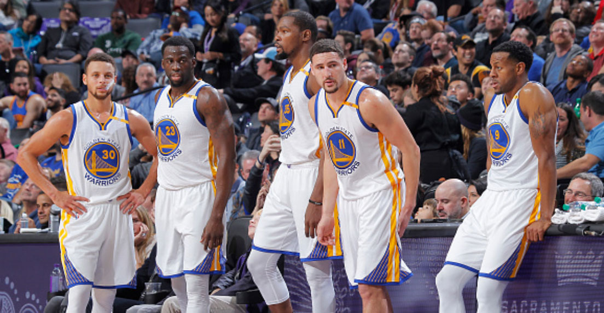
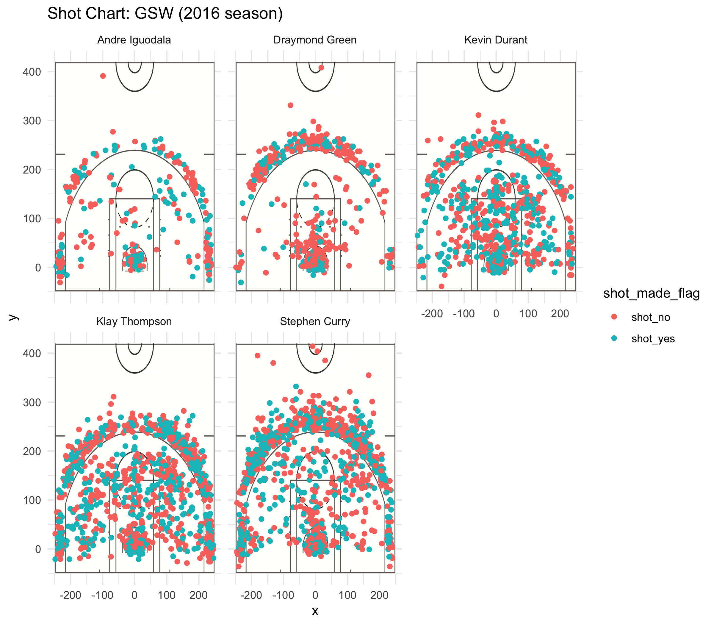

```{r setup, include=FALSE}
knitr::opts_chunk$set(echo = TRUE)
```
### Background
To many basketball players and fans, the name "Golden State Warriors" elicits a wide range of emotions. It sparks fear in competing teams, excitement and pride in its Bay Area fans, and a universal respect for the accomplishments the team has managed to achieve. Along with the team's rise in notoriety and success, many have noted that the team has also had a profound influence on the game itself. Within the team are an unusually high number of capable shooters and coupled with some record-breaking individuals, have drastically changed how other teams have had to play in order to compete with the Golden State Warriors.

### Motivation
But what exactly about the Golden State Warriors has contributed to such a dominating performance in the NBA? We can generally state that they have a handful of effective shooters, but to get an even better idea of just how skilled the team is, we turn to the numbers. By carefully looking at the shooting statistics of five key players Golden State Warrior players, we can get an idea of just how impressive their skills are and gain a newfound appreciation for this team. Specifically, the players we are taking a look at are Andre Iguodala, Draymond Green, Klay Thompson, Kevin Durant, and Stephen Curry, who are pictured below.

```{r out.width = '80%', echo = FALSE, fig.align = 'center'}

```

### Effective Shooting Percentages
Let's take a look at the effective shooting percentages of five key players, who each play differing roles on the Warriors. Since there are a variety of different shots, we divide the shots into two categories, three-pointers (which are taken from outside the three-point line) and two-pointers (which are from inside the three-point line) before examining them together as a whole. First, let's take a look at the effective shooting percentages of two-pointers made by our five key players.
```{r importing_data, include="FALSE"}
library(dplyr)
library(grid)
```
```{r effective_two_point}
data <- read.csv('../data/shots-data.csv')
two_point_data <- group_by(data[data$shot_type == '2PT Field Goal',], name)
effective_two_point <- select(arrange(summarise(two_point_data, total = n(), made = sum(shot_made_flag == "shot_yes"), perc_made = made/total), desc(perc_made)), name, total, made, perc_made)
```
#### Effective Two Point Shooting Percentage
```{r comment = '', echo = FALSE}
knitr::kable(effective_two_point)
```

As you can see here, the five players make two-pointers with a success rate of about 50 to 60%. As a point of reference, although there is a 10% difference, it is good to note that the five different players play different roles, showing a high standard of shooting ability despite the different roles. As a point of reference, in the 2016 season, the average shooting percent rate for the Warriors was around 56.8% and this had them positioned at the highest percentage according to the NBA statistics.

#### Effective Three Point Shooting Percentage
```{r effective_three_point}
three_point_data <- group_by(data[data$shot_type == '3PT Field Goal',], name)
effective_three_point <- select(arrange(summarise(three_point_data, total = n(), made = sum(shot_made_flag == "shot_yes"), perc_made = made/total), desc(perc_made)), name, total, made, perc_made)
```
```{r comment = '', echo = FALSE}
knitr::kable(effective_three_point)
```

Although the numbers look quite a bit smaller than the table for two-pointers, most other teams have an average shooting percentage of around mid 30% ranges. As such, some of the five we are examining have a significantly higher three-point shooting percentage. Additionally, even the lowest in the five players, Draymond, shoots at 31% which is the average for some of the other teams. Clearly, in a team, not every member functions primarily as a shooter. Some work well as defenders, like Draymond Green, but despite this, he still is able to be quite effective at making three-pointers.

### Effective Total Shooting Percentage
```{r effective_total}
total_data <- group_by(data, name)
effective_total <- select(arrange(summarise(total_data, total = n(), made = sum(shot_made_flag == "shot_yes"), perc_made = made/total), desc(perc_made)), name, total, made, perc_made)
```
```{r comment = '', echo = FALSE}
knitr::kable(effective_total)
```

Now we examine the total shooting percentage, which combine the data from the two-point data and the three-point data. We see that the numbers are in between the two and three point shooting percentages and range from 42 to 54%. According to NBA Advanced Stats, in the 2916-2017 season, the Golden State Warriors had a field goal (which refers to both the two-pointers and three-pointers) percentage of 51%. The next highest teams have a percentage of 50% and most have percentages in the 40s. Although these numbers we see don't see that much higher than of other teams, looking at individual statistics is different from averages because again, different roles have varying expected field goal percentages. Having a high standard of shooting effectiveness is a large advantage for the Golden State Warriors.

### A Visual
We take a step away from viewing the numbers to see a more visual representation of the shooting effectiveness of the five players we are examining. This visual shows on a court where the shot was taken and uses colors to indicate whether the shot was made or not. Thus, by looking at the colors and their location, we can get an idea of the shooting effectiveness.

```{r out.width = '80%', echo = FALSE, fig.align = 'center'}

```

In particular with Stephen Curry, Klay Thompson, and Kevin Durant, it is fascinating to see just how much of the court they are able to shoot successfully from. More typically, someone like Andre Iguodala shoots largely from right at the three point line or a little bit in front as well as inside the paint. However, for those other three players, they pretty much are able to shoot from anywhere in the diagram. Looking at Stephen Curry, you can also see just how far away from the hoop he is able to still shoot effectively. If all players on the court are fairly capable at shooting, this makes defense much more difficult as they can't pinpoint a weaker person to compensate for the superstar shooters like Curry. All combined, this makes for a very difficult team to defend.

### Concluding Thoughts
By looking at both the numbers and a more visual representation, one can clearly see what makes the Golden State Warriors so formidable. Their leading in numbers in terms of shooting effectiveness and the demonstration of this effective with multiple players in the team result in a team that excelt in offense. Especially coupled with the fact that no other team has quite had such a high number of outstanding three-point shooters makes the Golden State Warriors a revolutionary team composition. 

The numbers, compared to other NBA stats, provide the lead needed for the Warriors to have a successful season. In the past, basketball revolved mostly around centers and playing in the paint. However, upon looking at the shooting percentages for three-pointers as well as the visual representation, you can see the sheer number of shots taken and made from further out on the court. This shift in the play style, once effective, has proven to be difficult to play against, as traditional defensive maneuvers are no longer able to keep up with the Their success ushers in a new style of playing that forces other teams to adapt to or lose.